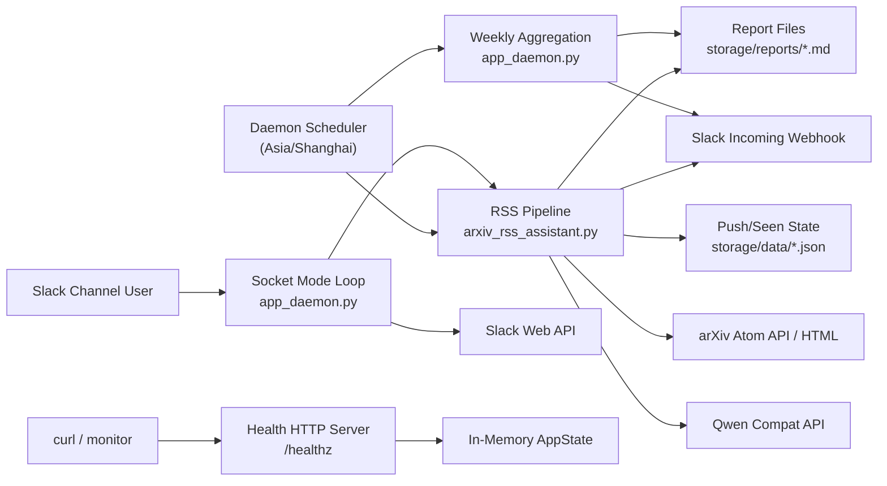

# 02 架构设计文档（Architecture Design）

## 背景

系统需要在单进程内长期稳定运行，并同时处理“定时任务 + 外部 API 交互 + 命令控制 + 健康观测”。架构设计重点是：
- 用最少进程复杂度保障可维护性
- 用清晰边界支撑后续 AI 代理增量开发
- 在网络不稳定下保持主流程韧性

## 决策

### A-001 系统上下文（Context）

### A-002 组件边界（Boundary）

| 组件 | 责任 | 不负责 |
| --- | --- | --- |
| `app_daemon.py` | 线程编排、调度、命令接入、健康接口 | 论文分类细节、Slack 单条推送重试细节 |
| `arxiv_rss_assistant.py` | 拉取/分类/增强/报告/推送/状态持久化 | 进程生命周期管理、Socket Mode 长连接 |
| `slack_cmd_toolkit.py` | 命令解析与命令响应 payload 生成 | 任务调度与状态持久化 |
| `slack_healthcheck.py` | Slack Web API 基础调用封装 | 业务级命令路由 |
| `paperrss_utils.py` | 日志与 JSON IO 通用能力 | 业务规则判断 |

### A-003 关键架构决策（ADR 映射）

| ADR 编号 | 决策 | 理由 |
| --- | --- | --- |
| ADR-0001 | 维持单进程多线程守护模式 | 依赖最少、部署简单、便于 NAS/轻量容器运行 |
| ADR-0002 | 调度统一固定 `Asia/Shanghai` | 降低跨时区触发歧义 |
| ADR-0003 | 推送状态增量落盘（按消息回调） | 减少中途失败造成的重复推送 |
| ADR-0004 | LLM 与作者增强可开关 | 控制成本并保证降级可用 |

### A-004 扩展点

- E-001：新增排序策略，在 `ranking_tuple` 扩展即可。
- E-002：新增 Slack 命令，在 `slack_cmd_toolkit.build_command_response` 与 socket loop 路由扩展。
- E-003：新增日报/周报输出格式，在 `render_report` 与 `build_weekly_report_markdown` 扩展。

## 约束

- 当前不引入消息队列、数据库或分布式调度器。
- 状态持久化格式固定为 JSON 文件，不做迁移器。
- Slack 推送当前基于 Incoming Webhook（非 chat.postMessage thread 编排模型）。

## 示例

### 架构落地示例：新增“月报”能力

建议路径：
1. 在 daemon 新增 `monthly_report_loop`（编排层）
2. 在 assistant 复用日报解析与聚合逻辑（能力层）
3. 在配置字典新增 `monthly_report_time_bjt` 与 `monthly_output_dir`（接口层）
4. 在 ADR 中记录触发策略与窗口定义（治理层）

## 验收

- 从本架构文档可明确模块边界，不出现“在哪改”不清晰的问题。
- 任一功能变更都可定位到对应组件与 ADR 条目。
- 架构图与当前代码入口函数一致（`run/daily_rss_loop/weekly_report_loop/socket_mode_loop/health_server_loop`）。
