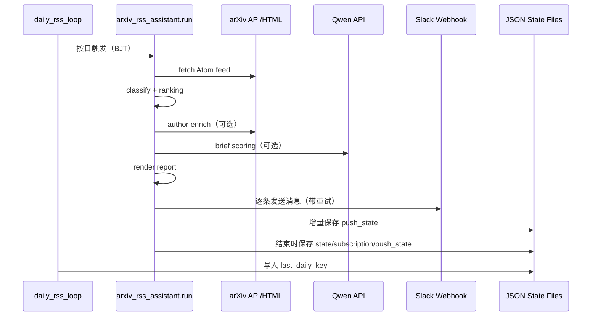
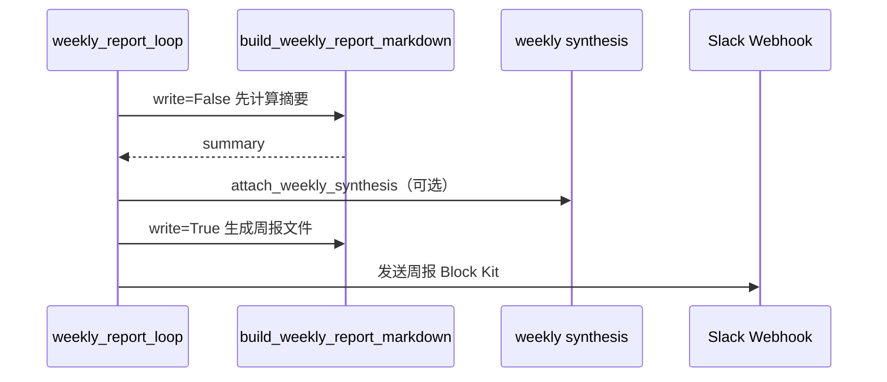
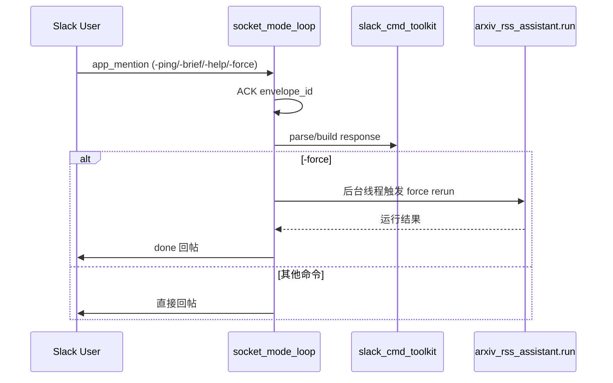
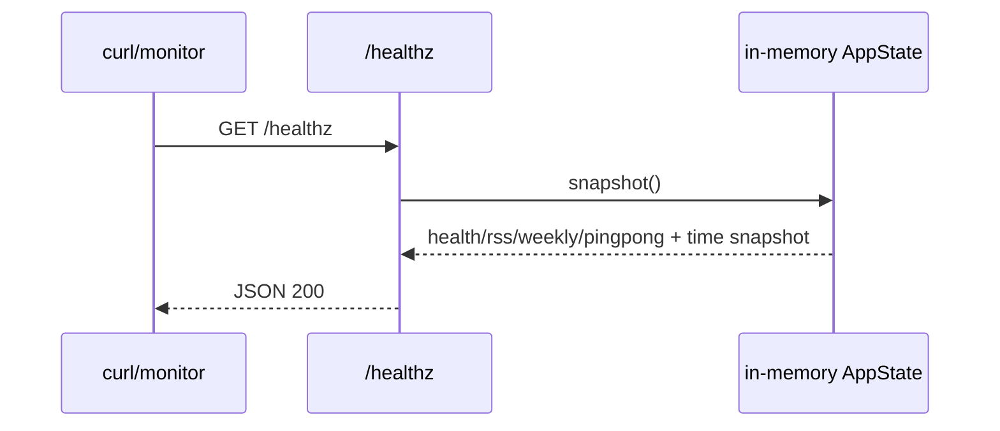

# 03 系统设计文档（System Design）

## 背景

系统设计关注“代码如何运行与落盘”，用于直接指导实现与排障。核心对象包括：
- 四个并发循环的时序关系
- 状态文件模型与更新时机
- Slack 消息结构契约
- 错误处理、重试、幂等与降级策略

## 决策

### S-001 核心时序

#### 1) 日报时序（daily）



#### 2) 周报时序（weekly）



#### 3) 命令通道时序（socket mode）



#### 4) 健康检查时序



### S-002 状态模型（State Schema）

#### 1) `rss_state`（默认 `storage/data/state.json`）

```json
{
  "last_run": "2026-03-13T08:00:00Z",
  "seen_ids": ["2503.00001", "2503.00002"]
}
```

| 字段 | 类型 | 语义 | 更新时机 |
| --- | --- | --- | --- |
| `last_run` | string\|null | 上次 RSS 运行 UTC 时间 | 每轮 run 结束 |
| `seen_ids` | string[] | 已见论文 ID 集合（最多 5000） | 每轮 run 结束 |

#### 2) `subscription_store`（默认 `storage/data/subscriptions.json`）

```json
{
  "seen_ids": ["2503.00001", "2503.00002"]
}
```

#### 3) `push_state`（默认 `storage/data/push_state.json`）

```json
{
  "schema_version": 2,
  "pushed_by_date": {
    "2026-03-13": ["2503.00001", "2503.00002"]
  },
  "pushed_report_dates": ["2026-03-13"]
}
```

| 字段 | 类型 | 语义 | 更新时机 |
| --- | --- | --- | --- |
| `pushed_by_date` | map<date, string[]> | 每日已推论文 ID | 每条消息成功后增量写 + 轮次结束再写 |
| `pushed_report_dates` | string[] | 已推送过报告的日期键 | 每条消息成功后增量写 + 轮次结束再写 |

#### 4) `schedule_state`（默认 `storage/data/schedule_state.json`）

```json
{
  "last_daily_key": "2026-03-13",
  "last_weekly_key": "2026-03-09"
}
```

#### 5) `app_state`（内存，`/healthz` 输出）

```json
{
  "health": {"last_status": "ok", "last_error": null},
  "rss": {"last_run_at": "...", "next_run_at": "...", "last_status": "ok", "last_error": null},
  "weekly": {"last_run_at": "...", "next_run_at": "...", "last_status": "ok", "last_error": null},
  "pingpong": {"last_poll_at": "...", "last_reply_at": "...", "last_status": "ok", "last_error": null}
}
```

### S-003 Slack 消息接口契约

#### 日报推送（Webhook）

- M-DAILY-001：第一条必须是 overview（header + fields + top picks）。
- M-DAILY-002：后续每条对应一篇论文，顺序与 ranking 一致。
- M-DAILY-003：单篇详情包含 `Score/Published/Tags/Authors(or emails)/Interest matches/Brief/Abstract snippet/Open arXiv`。

#### 周报推送（Webhook）

- M-WEEKLY-001：单条卡片，包含窗口、计数、主题、takeaways、best-of-week。

### S-004 错误处理与重试

| 场景 | 行为 |
| --- | --- |
| Slack webhook HTTPError | 读取 `Retry-After` 或指数退避重试，最多 `slack_max_retries` |
| Slack webhook 其他异常 | 指数退避重试，最终记录失败 |
| 作者抓取失败 | 写入 `author_profile.error`，不终止整体流程 |
| LLM 调用失败 | 写入 `llm_brief.error`，回退 heuristic/已有结果 |
| 周报读取日报异常 | `parse_daily_report` 返回空结构，不抛出致命异常 |

### S-005 幂等语义

- I-001：去重基于 `push_state.pushed_by_date`，重启后仍有效。
- I-002：`force_push=true` 可绕过去重。
- I-003：`schedule_state` 防止同一天/同一周重复触发调度任务。

### S-006 容量边界与降级策略

| 维度 | 当前策略 |
| --- | --- |
| `seen_ids` 规模 | 截断保留最新 5000 |
| 作者增强吞吐 | `author_enrich_max_papers` + worker 并发控制 |
| LLM 成本控制 | `llm_brief_max_papers` + 缓存 + 开关 |
| 推送速率 | `slack_send_interval_seconds` 控制节流 |

## 约束

- 本文档不定义未来线程模型变更，仅描述当前单进程多线程实现。
- 状态字段新增/删除必须同步更新 [04-config-reference.md](04-config-reference.md) 与 [06-adr-log.md](06-adr-log.md)。
- Slack 消息结构若变更，需保持“摘要先行”阅读体验不退化。

## 示例

### 示例：日报推送中途失败的恢复

1. 已成功发送第 1~5 条消息后网络故障。
2. `on_message_sent` 已将前 5 条对应 paper_id 落入 `push_state`。
3. 进程重启后再次运行，去重逻辑只会继续推送未成功部分。

## 验收

- 设计文档可直接回答“状态写在哪、何时写、失败如何恢复”。
- 任意故障场景可在本文定位到对应重试/降级规则。
- 消息契约可作为后续回归测试依据。
